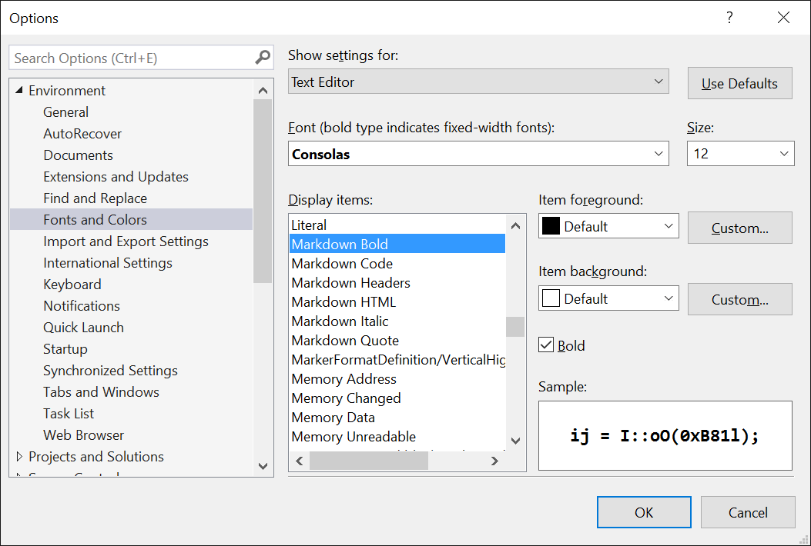
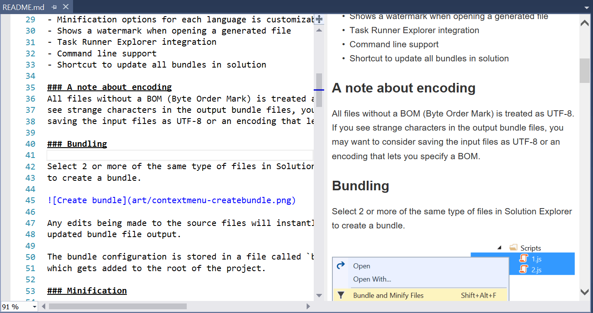
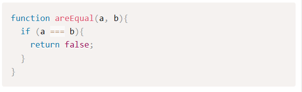
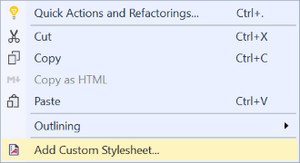
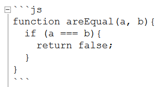
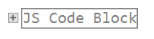
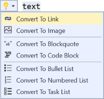
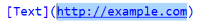
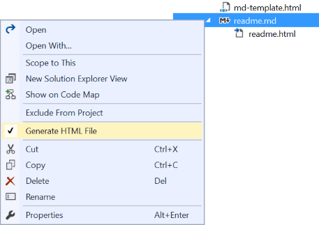
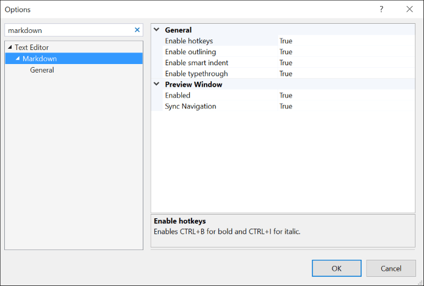

# Markdown Editor

[](https://ci.appveyor.com/project/madskristensen/markdowneditor)

Download this extension from the [VS Gallery](https://visualstudiogallery.msdn.microsoft.com/eaab33c3-437b-4918-8354-872dfe5d1bfe) ([VS 2022](https://marketplace.visualstudio.com/items?itemName=MadsKristensen.MarkdownEditor64))
or get the [CI build](http://vsixgallery.com/extension/9ca64947-e9ca-4543-bfb8-6cce9be19fd6/).

---------------------------------------

A full featured Markdown editor with live preview and syntax highlighting.
Supports GitHub flavored Markdown.

See the [change log](CHANGELOG.md) for changes and road map.

## Features

- Powered by [Markdig](https://github.com/lunet-io/markdig) - the best markdown parser
- Syntax highlighting
- Live preview window with scroll sync
- Mermaid chart support
- CommonMark and GitHub flavored Markdown
- High-DPI support
- Drag 'n drop of images supported
- Paste image from clipboard directly onto document
- Outlining/folding of code blocks
- Keyboard shortcuts
- Light Bulbs
- Brace completion with type-through
- Lightning fast
- Auto-generate HTML files

### Syntax highlighting
All fonts can be changed in **Tools -> Options -> Environment -> Fonts and Colors**
dialog.



#### GitHub and other flavors
Advanced markdown extensions are supported to give more features to
the syntax. This includes pipe tables, emoji, mathematics and a lot
more.

### Live Preview Window
The preview window opens up on the right side of the document when
it opens.



Every time the markdown document is modified, the preview window
will update.

Any code blocks receives full syntax highlighting in the preview
window. Here's an example of JavaScript code rendered.



The preview window is automatically scrolled to match the scroll
position of the document. As the document is scrolled up and down,
the preview window will follow.

Live preview can be disabled in the [settings](#settings).

> The syntax highlighter is powered by [Prism](http://prismjs.com/)

#### Custom stylesheets
The preview window supports loading of custom stylesheets. It will
look for a file called **md-styles.css** in the same directory as
the currently opened markdown file or any parent directory.

If no **md-styles.css** file is found it will look for it in
_%userprofile%_. If it still isn't found it will use the built in
stylesheet.

To generate a custom stylesheet, simply right-click inside the
markdown editor document and select _Add Custom Stylesheet..._



The name of the custom stylesheet can be changed in the settings.

#### Preview HTML template
The preview window also supports loading of HTML template,
which will be detailed in **Auto-generate HTML files** section.

When the markdown document is updated, the markdown editor will
call `onMarkdownUpdate` function if it exists. With this feature,
you can support your own scripts, for example KaTeX for LaTeX.

### Drag 'n drop images
Drag an image directly from Solution Explorer onto the document to
insert the appropriate markdown that will render the image.

### Paste images
This is really helpful for copying images from a browser or for
inserting screen shots. Simply copy an image into the clipboard and
paste it directly into the document. This will prompt you for a file
name relative to the document and then it inserts the appropriate
markdown.

It will even parse the file name and make a friendly name to use
for the alt text.

### Outlining
Any fenced code and HTML blocks can be collapsed, so that this:



...can be collapsed into this:



### Keyboard shortcuts
**Ctrl+B** makes the selected text bold by wrapping it with `**`.

**Ctrl+I** makes the selected text italic by wrapping it with `_`.

**Ctrl+Shift+C** wraps the selected text in a code block.

**Ctrl+Space** checks and unchecks task list items.

```markdown
- [x] task list item
```

**Tab** increases indentation of list items.

**Shift+Tab** decreases indentation of list items.

**Ctrl+K,C** wraps the selection with HTML comments.

**Ctrl+K,U** removes HTML comments surrounding the selection/caret.

**Ctrl+PgUp** moves caret to previous heading

**Ctrl+PgDown** moves caret to next heading

### Light Bulbs
The suggested actions shown in light bulbs makes it easier to
perform common tasks.



For instance, converting the selected text to a link will result
in this:



### Auto-generate HTML files
By right-clicking any Markdown file in Solution Explorer,
you can turn on automatic generation of a HTML file.



It will wrap the output rendered markdown in a HTML template 
that looks like this:

```html
<!DOCTYPE html>
<html>
<head>
    <title>[title]</title>
</head>
<body>

    [content]

</body>
</html>
```

You can provide your own HTML template by dropping a file with
the name **md-template.html** in the same or parent folder to
the markdown file. If not found, it will search _%userprofile%_.

Just make sure to include the *[content]* token in the template.
And the *[title]* token is optional if you need a title.

### Settings
Control the settings for this extension under
**Tools -> Options -> Text Editor -> Markdown**



## Contribute
Check out the [contribution guidelines](.github/CONTRIBUTING.md)
if you want to contribute to this project.

For cloning and building this project yourself, make sure
to install the
[Extensibility Tools 2015](https://visualstudiogallery.msdn.microsoft.com/ab39a092-1343-46e2-b0f1-6a3f91155aa6)
extension for Visual Studio which enables some features
used by this project.

## License
[Apache 2.0](LICENSE)
